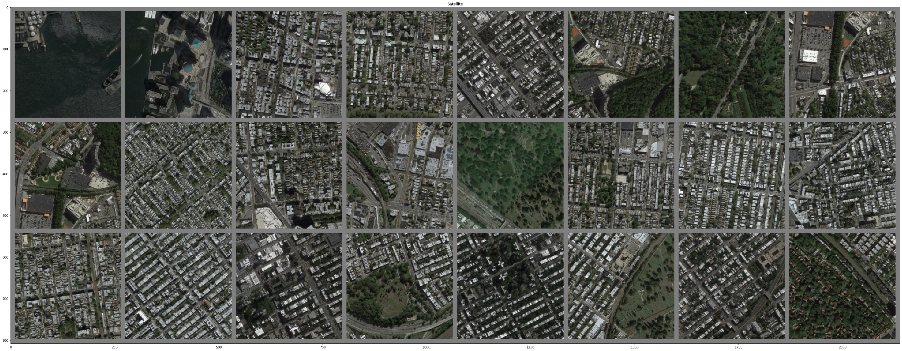
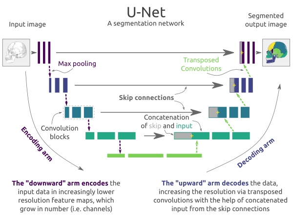

#  Satellite to Map Translation with Pix2Pix GAN

A PyTorch implementation of a **Pix2Pix-style GAN** that transforms satellite imagery into corresponding map views. This project builds the model architecture from scratch using U-Net for the generator and a conditional discriminator for training.

**Paper Reference**: [Image-to-Image Translation with Conditional Adversarial Networks (Isola et al., 2016)](https://arxiv.org/abs/1611.07004)

---

## Sample Output

- The image patch with 24 samples below shows the results of the Sat2Map Generator.
- Satellite imagery (input):
 <!-- Replace with actual image path -->
- Map Representation (output):

- The Generator successfully learned to capture main structures in satellite imagery such as roads, buildings, forests, rivers, seas, etc, map those structures to an encoded vector, and then map the encoded vector back to a full image with map representation.

---

##  Pretrained Models

- [Download Trained Generator & Discriminator Weights](#)
- [Download Sat2Map Dataset](#)

---

## Hyperparameters Used
- As suggested by the paper in the reference, here are the values of the hyper-parameters to train the Sat2Map model:

| Parameter         | Value        |
|------------------|--------------|
| Batch Size       | 1            |
| Image Resolution | 256 × 256    |
| Learning Rate    | 0.0002       |
| Adam Betas       | (0.5, 0.999) |
| L1 Loss Weight   | 100          |

---

## Understanding cGANs

Unlike classic GANs that generate images from random noise `z`, **Conditional GANs** (cGANs) take both noise and an input image `x` to generate an output `G(z|x)`. This ensures the generated image is not just realistic but also relevant to the input.

The discriminator evaluates pairs `(x, y)` and decides whether `y` is a plausible translation of `x`. This makes cGANs ideal for tasks like satellite-to-map translation.

---

## Generator - U-Net Architecture

- Uses an **Encoder-Decoder** design with skip connections.
- Based on the [U-Net model](https://arxiv.org/abs/1505.04597), popular in image segmentation.
- Retains spatial features via connections between encoder and decoder layers.
- 

> This project uses a U-Net adapted for 256x256 images.

---

## Discriminator - PatchGAN

- A convolutional classifier that judges small patches of the image.
- Inputs are the **concatenation** of the source (satellite) and target (map) images.
- Outputs a grid where each cell evaluates a local patch as real or fake.

---
## Loss Function

- In Image translation task, the GAN training scheme is almost the same as the original GAN, except now we have conditional input and an additional L1 loss to ensure the generated image is not too different from the expected output.
#### GAN Loss:
- 
- Just like original GAN, optimizing this Loss will forces the Generator to produce results with overall distribution close to that of the image representation in the dataset and thus improve the structural quality of the Generator's output.
#### L1 Loss:
- 
- By using pixel-wise loss between 2 images, this loss forces the output image to be as close to the expected output as possible. In other words, it improves the minor details of the output.
#### Final Loss:
- 
- We simply combine GAN loss and L1 Loss to have the final Loss for the entire algorithm.


## Project Structure (Recommended)
```bash
├── data/
│ └── sat2map/
├── checkpoints/
├── outputs/
├── models/
├── utils/
├── train.py
├── test.py
└── README.md


---
